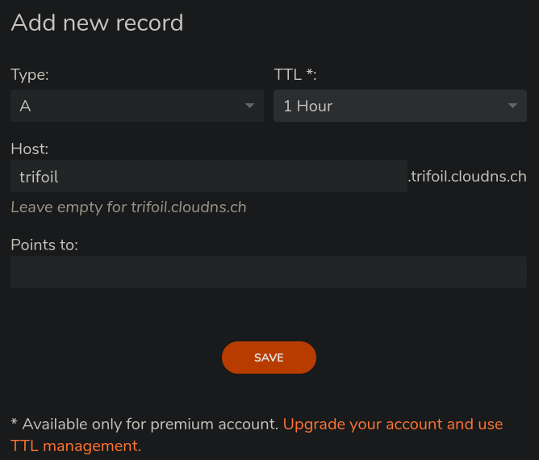

# Server installation for noobie

```
rm -rf Fedora-server
git clone https://github.com/trifoil/Fedora-server.git
cd Fedora-server
sh main.sh
cd ..
clear
```

## Full setup

```
git clone https://github.com/trifoil/Fedora-server.git
cd Fedora-server
chmod +x globalsetup.sh
sudo ./globalsetup.sh
```

> [!IMPORTANT]  
> PLEASE CHANGE MY DOMAIN NAME BY YOURS IN THE CONFIG FILES

## Manual instructions (post setup)

1) Connect to cockpit using port 9090
    * Directly set up a static IP address !

2) Access portainer on port 9443

3) Access nginx on port 81
    * Default credentials:
        * Email:    admin@example.com
        * Password: changeme

4) Access phpMyAdmin
    * Default credentials:
        * User: root as the  and 
        * Password: password

5) Access NEXTCLOUD AIO
    * Default credentials:
        No default. Connect locally and choose.

        

    * Then access to your server cli:
        ```
        docker exec -it nextcloud /bin/bash
        apt-get update
        apt-get install nano
        nano config/config.php
        ```
        Modify the 
        ```
        'trusted_domains' => 
        array (
            0 => 'localhost:8888',
        ),
        ```
        by adding your domain name, ie:
        ```
        'trusted_domains' => 
        array (
            0 => 'localhost:8888',
            1 => 'nextcloud.trifoil.ch',
        ),
        ```

## A pointer 

1) Add a new A record for your domain

2) Put your public IP addr and the subdomain you want to make reachable (here trifoil.trifoil.cloudns.ch)

## SSL certificate

In nginx, set up the SSL certificate :

* "Add SSL certificate" -> "Let's encrypt"

* Domain name : ```trifoil.trifoil.cloudns.ch```

* If you try to reach the server, the output should be :

* DNS challenge is not required

## Proxy Host

Add proxy host :

* Go to "Dashboard" -> "Proxy Hosts" -> "Add Proxy Host"

* Fill in :
    * Domain Names : the domain you set up in the step 1 (here, trifoil.trifoi.cloudns.ch)
    * Scheme https if anyone else has access to your LAN
    * IP is the IP of your server in your LAN
    * Forward Port is the port where you access your website, defined in the yaml file

## Access your website

Enjoy :)

👉 https://trifoil.trifoil.cloudns.ch/

## Useful links

* https://nginxproxymanager.com/guide/#quick-setup
* https://thriveread.com/docker-apache-httpd-with-php-fpm-and-mysql/
* https://github.com/charmbracelet/gum
* https://github.com/TaitoUnited/full-stack-template/blob/dev/docker-compose.yaml
* https://www.cloudbees.com/blog/using-docker-compose-for-nodejs-development
