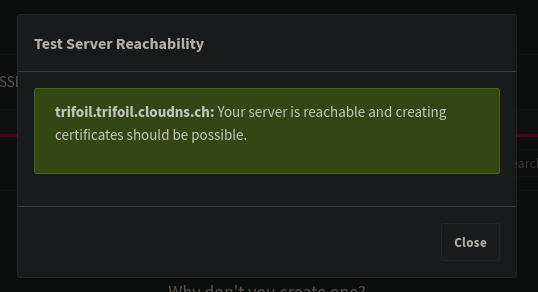
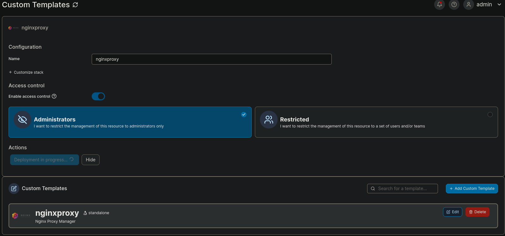

# Server installation for noobie

## Initial setup

The script gets all my useful files and sets up the tools

first, run 

```
curl -O https://raw.githubusercontent.com/trifoil/Fedora-server/main/setup.sh
chmod +x setup.sh
sudo ./setup.sh
```

Then connect to cockpit using port 9090

Directly set up a static IP address !

Access portainer on port 9443


## Docker website

```
cd Downloads
git clone https://github.com/trifoil/Fedora-server.git
cd Fedora-server/first_test
docker build -t webtest .
docker run -d -p 8080:80 webtest
```

## Nginx proxy manager

In portainer, go to App templates -> custom templates




https://nginxproxymanager.com/guide/#quick-setup



